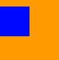

# 外边距塌陷(margin collapsing)

> * 外边距塌陷只在正常流布局中出现, float布局, flex布局, 定位布局等情况下无效.
> * 发生外边距塌陷的三种情况: 相邻兄弟姐妹元素, 块级父元素与其第一个/最后一个子元素, 空块元素


块元素 *顶部外边距* 和 *底部外边距* 有时被组合(折叠)为单个外边距, 其大小是组合到其中的最大外边距, 这种行为称为 **外边距塌陷(margin collapsing)** , 有的地方翻译为外边距合并.

发生外边距塌陷的三种情况:

#### 相邻的兄弟姐妹元素
毗邻的两个兄弟元素之间的外边距会塌陷

如:
```html
<p style="margin-bottom: 30px;">这个段落的下外边距被合并...</p>
<p style="margin-top: 20px;">...这个段落的上外边距被合并。</p>
```
可以发现这两个段落中间的距离，不是 ”上面段落的下边距“ 与 ”下面段落的上边距“ 的 求和 ，而是两者中的较大者（在此示例中为30px）。


#### 块级父元素与其第一个/最后一个子元素
如果块级父元素中，不存在上边框、上内边距、内联元素、清除浮动 这四条属性（也可以说，当上边框宽度及上内边距距离为0时），那么这个块级元素和其第一个子元素的上边距就可以说”挨到了一起“。此时这个块级父元素和其第一个子元素就会发生上外边距合并现象，换句话说，此时这个父元素对外展现出来的外边距将直接变成这个父元素和其第一个子元素的 `margin-top` 的较大者。

示例HTML代码:
```html
<div class="out">
    <div class="in"></div>
</div>
```

CSS代码:
```css

        * {
            margin: 0;
            padding: 0;
        }


        .out {
            width: 100px;
            height: 100px;
            background-color: orange;
        }

        .in {
            width: 50px;
            height: 50px;
            background-color: blue;

            margin-top: 10px;
        }
```

效果如下:
 


示例中如果设置了父元素的上边框或者上边距(有个阻挡), 子元素的外边距不会发生塌陷现象

修改的CSS代码:
```css
* {
            margin: 0;
            padding: 0;
        }


        .out {
            width: 100px;
            height: 100px;
            background-color: orange;

            border-top: 1px solid transparent; /* 父元素添加上边框 */
        }

        .in {
            width: 50px;
            height: 50px;
            background-color: blue;

            margin-top: 10px;
        }
```
效果如下:




类似的，若块级父元素的 `margin-bottom` 与它的最后一个子元素的 `margin-bottom` 之间没有父元素的 `border`、`padding`、`inline content`、`height`、`min-height`、 `max-height`分隔时，就会发生 *下外边距合并* 现象。

#### 空块元素
如果存在一个空的块级元素，其 `border`、`padding`、`inline content`、`height`、`min-height` 都不存在。那么此时它的上下边距中间将没有任何阻隔，此时它的上下外边距将会合并。例如：

```html
<p style="margin-bottom: 0px;">这个段落的和下面段落的距离将为20px</p>

<div style="margin-top: 20px; margin-bottom: 20px;"></div>

<p style="margin-top: 0px;">这个段落的和上面段落的距离将为20px</p>
```


