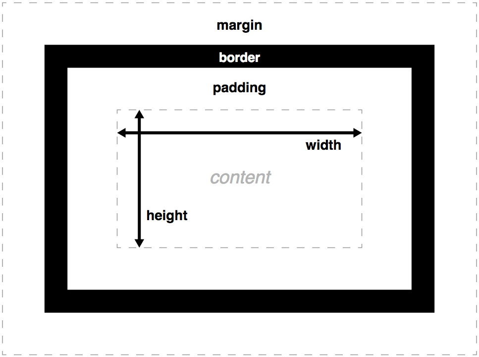

# 盒模型

盒模型是网页布局的基础

在CSS中, 每个元素被表示(看做)为一个矩形的盒子

盒子从内到外分别由 `content`(内容区) `padding`(内边距) `border`(边框) `margin`(外边距) 组成

#### `width` 和 `height`: 
`width` 和 `height` 设置内容区(content box)的宽度和高度. 内容盒是盒子内容显示的区域--包括盒子内的文本内容, 以及表示嵌套子元素的其它盒子.

#### `padding`:
padding 表示一个CSS盒子的内边距--这一层位于内容盒的外边缘与边框的内边缘之间. 该层的大小可以通过简写属性 `padding` 一次设置所有四个边, 或用 `padding-top` `padding-right` `padding-bottom` 和 `padding-left` 属性一次设置一个边.

#### `border`:
CSS盒的边框(border)是一个分隔层, 位于内边距的外边缘以及外边距的内边缘之间. 边框的默认大小为0--从而让它不可见--不过我们可以设置边框的宽度, 样式和颜色让它出现. `border` 简写属性可以让我们一次设置所有四个边, 例如: `broder: 1px solid black;` 但这个简写可以被各种普通书写的更详细的属性所覆盖:

* `border-top` `border-right` `border-bottom` `border-left`: 分别设置某一边框的宽度,样式,颜色.

* `border-width` `border-style` `border-color`: 分别仅设置边框的宽度,风格,颜色, 并应用到全部四边边框.

* 你也可以单独设置某一个边的三个不同属性, 如 `border-top-width`, `border-top-style`, `border-top-color` 等. 

#### `margin`:
外边距(margin)代表CSS盒子周围的外部区域, 在布局中推开其它CSS盒子. 其表现与padding很相似. 简写属性 `margin`, 单个属性分别为 `margin-top` `margin-right` `margin-bottom` `margin-left`

 
    