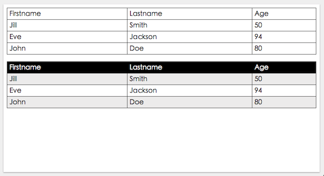

## 知识点
#### 1. HTTP服务器端和客户端原理

#### 2. HTML文件

#### 3. HTML中的元素(Element)和标签(tag)区别

#### 4. HTML元素的属性作用

#### 5. 常用HTML元素

#### 6. 常用HTML属性 

## 代码清单
* [HTML Introduction](http://w3schools.bootcss.com/html/html_intro.html)

* [HTML Basic](http://w3schools.bootcss.com/html/html_basic.html)

* [HTML Element](http://w3schools.bootcss.com/html/html_elements.html)

* [HTML Attributes](http://w3schools.bootcss.com/html/html_attributes.html)

* [HTML Headings](http://w3schools.bootcss.com/html/html_headings.html)

* [HTML Paragraphs](http://w3schools.bootcss.com/html/html_paragraphs.html)

* [HTML Styles](http://w3schools.bootcss.com/html/html_styles.html)

* [HTML Formatting](http://w3schools.bootcss.com/html/html_formatting.html)

* [HTML Colors](http://w3schools.bootcss.com/html/html_colors.html)

* [HTML Links](http://w3schools.bootcss.com/html/html_links.html)

* [HTML Images](http://w3schools.bootcss.com/html/html_images.html)

* [HTML Tables](http://w3schools.bootcss.com/html/html_tables.html)

## 限时代码(5min)


```html
<!DOCTYPE html>
<html>
<head>
<style>
table {
    width:100%;
}

/* 同时选取所有table, th, td元素 */
table, th, td {
    border: 1px solid black;
    border-collapse: collapse;
}

/* 同时选取所有th, td元素 */
th, td {
    padding: 5px;
    text-align: left;
}

/* 选取id为t01的table元素中的所有偶数tr子元素 */
table#t01 tr:nth-child(even) {
    background-color: #eee;
}

/* 选取id为t01的table元素中的所有奇数tr子元素*/
table#t01 tr:nth-child(odd) {
   background-color:#fff;
}

/* 选取id为t01的table元素下的所有th子元素 */
table#t01 th {
    background-color: black;
    color: white;
}
</style>
</head>
<body>

<table>
  <tr>
    <th>Firstname</th>
    <th>Lastname</th> 
    <th>Age</th>
  </tr>
  <tr>
    <td>Jill</td>
    <td>Smith</td>
    <td>50</td>
  </tr>
  <tr>
    <td>Eve</td>
    <td>Jackson</td>
    <td>94</td>
  </tr>
  <tr>
    <td>John</td>
    <td>Doe</td>
    <td>80</td>
  </tr>
</table>
<br>

<table id="t01">
  <tr>
    <th>Firstname</th>
    <th>Lastname</th> 
    <th>Age</th>
  </tr>
  <tr>
    <td>Jill</td>
    <td>Smith</td>
    <td>50</td>
  </tr>
  <tr>
    <td>Eve</td>
    <td>Jackson</td>
    <td>94</td>
  </tr>
  <tr>
    <td>John</td>
    <td>Doe</td>
    <td>80</td>
  </tr>
</table>

</body>
</html>

```